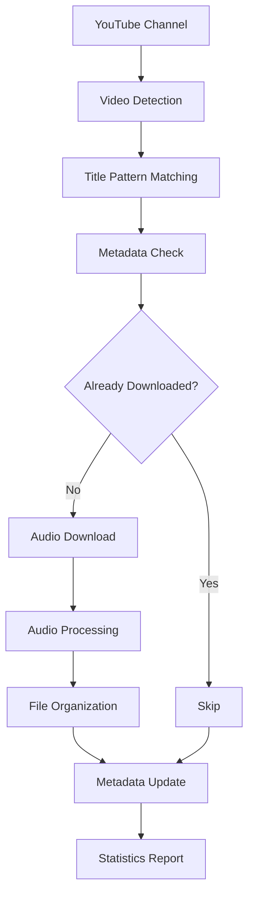

# 📥 YouTube Scraper - Documentação Técnica

## 📋 Visão Geral

O **YouTube Scraper** é um sistema automatizado para coleta de áudios das reuniões dos Conselhos Superiores da UFS (CONSU e CONEPE) disponíveis no canal da TV UFS no YouTube.

### ✨ Principais Características

- **Detecção Inteligente:** Identifica automaticamente vídeos de reuniões pelos títulos padronizados
- **Download Otimizado:** Baixa apenas o áudio em formato otimizado para transcrição (WAV, 16kHz, Mono)
- **Organização Automática:** Arquivos organizados por conselho e data com nomenclatura consistente
- **Controle de Duplicatas:** Evita downloads duplicados através de sistema de metadados
- **Recuperação de Falhas:** Retoma downloads interrompidos sem perder progresso
- **Logs Detalhados:** Sistema de logging para monitoramento e debugging

## 🏗️ Arquitetura



## 📁 Estrutura de Arquivos

```plaintext
src/
├── services/
│   └── youtube_scraper.py      ← Classe principal do scraper
├── config/
│   └── project_config.py       ← Configurações centralizadas
├── run_scraper.py              ← Script de execução
└── setup.py                    ← Script de configuração do ambiente

data/raw/audio/
├── consu/                      ← Áudios das reuniões CONSU
├── conepe/                     ← Áudios das reuniões CONEPE
└── metadata.json               ← Metadados dos downloads

scraper.bat                     ← Script batch para Windows
scraper.log                     ← Logs de execução
```

## 🔧 Dependências Técnicas

### Principais Bibliotecas

- **yt-dlp:** Download de vídeos/áudios do YouTube
- **ffmpeg-python:** Processamento e conversão de áudio
- **requests:** Comunicação HTTP
- **pathlib:** Manipulação de caminhos de arquivos

### Dependências do Sistema

- **Python 3.8+:** Linguagem de programação
- **FFmpeg:** Processamento de mídia (deve ser instalado separadamente)

## ⚙️ Configurações

### Padrões de Detecção

O scraper identifica vídeos usando expressões regulares:

```python
TITULO_PATTERN = re.compile(
    r"Sala dos Conselhos\s*\|\s*(\d{2}/\d{2}/\d{4})\s*\|\s*Sessão\s+(CONEPE|CONSU)\s*\|\s*#(\d+)",
    re.IGNORECASE
)
```

**Exemplos de títulos detectados:**
- `"Sala dos Conselhos | 21/07/2025 | Sessão CONEPE | #63"`
- `"Sala dos Conselhos | 30/06/2025 | Sessão CONSU | #63"`

### Configurações de Áudio

```python
AUDIO_CONFIG = {
    'format': 'bestaudio/best',
    'preferredcodec': 'wav',
    'preferredquality': '192',
    'sample_rate': '16000',  # 16kHz - ideal para speech recognition
    'channels': '1',         # Mono
}
```

### Nomenclatura de Arquivos

**Padrão:** `AAAA-MM-DD_conselho_#numero.wav`

**Exemplos:**
- `2025-07-21_conepe_#63.wav`
- `2025-06-30_consu_#63.wav`

## 📊 Sistema de Metadados

### Estrutura do metadata.json

```json
{
  "downloads": [
    {
      "video_id": "YouTube_Video_ID",
      "title": "Título original do vídeo",
      "output_path": "/caminho/para/arquivo.wav",
      "download_date": "2025-07-24T10:30:00.123456",
      "conselho": "consu|conepe",
      "data_reuniao": "21/07/2025",
      "numero_sessao": "63",
      "file_size_mb": 123.4
    }
  ],
  "last_update": "2025-07-24T10:30:00.123456"
}
```

### Benefícios do Sistema de Metadados

1. **Controle de Duplicatas:** Evita downloads desnecessários
2. **Rastreabilidade:** Histórico completo dos downloads
3. **Estatísticas:** Métricas de uso e crescimento da base de dados
4. **Recuperação:** Facilita recuperação em caso de falhas

## 🚀 Uso e Execução

### 1. Configuração Inicial

```bash
# Instalar dependências e configurar ambiente
python src/setup.py
```

### 2. Execução Básica

```bash
# Download completo (busca e baixa novos vídeos)
python src/run_scraper.py

# Com limites
python src/run_scraper.py --limit 20 --download-limit 5

# Apenas estatísticas
python src/run_scraper.py --stats

# Modo teste (busca sem baixar)
python src/run_scraper.py --test
```

### 3. Scripts Auxiliares

```bash
# Windows - usando arquivo batch
scraper.bat setup    # Configuração
scraper.bat          # Download completo
scraper.bat stats    # Estatísticas
scraper.bat test     # Teste
```

## 📈 Monitoramento e Logs

### Sistema de Logging

- **Arquivo:** `scraper.log` (na raiz do projeto)
- **Console:** Output em tempo real durante execução
- **Níveis:** INFO, WARNING, ERROR

### Exemplo de Log

```
2025-07-24 10:30:15 - youtube_scraper - INFO - Buscando vídeos do canal: https://www.youtube.com/@TVUFS/streams
2025-07-24 10:30:18 - youtube_scraper - INFO - Encontrado: Sala dos Conselhos | 21/07/2025 | Sessão CONEPE | #63
2025-07-24 10:30:20 - youtube_scraper - INFO - Total de reuniões encontradas: 15
2025-07-24 10:30:22 - youtube_scraper - INFO - Baixando: Sala dos Conselhos | 21/07/2025 | Sessão CONEPE | #63
2025-07-24 10:32:45 - youtube_scraper - INFO - Download concluído: 2025-07-21_conepe_#63.wav (87.3 MB)
```

## 🔍 Tratamento de Erros

### Principais Cenários de Erro

1. **Conexão com Internet:** Timeout, rede indisponível
2. **YouTube API:** Rate limiting, vídeos privados/removidos
3. **FFmpeg:** Problema na conversão de áudio
4. **Espaço em Disco:** Insuficiente para download
5. **Permissões:** Problemas de escrita no diretório

### Estratégias de Recuperação

- **Retry Logic:** Tentativas automáticas em falhas temporárias
- **Partial Downloads:** Retomada de downloads interrompidos
- **Graceful Degradation:** Continua processamento mesmo com falhas individuais
- **Detailed Logging:** Informações detalhadas para debugging

## 📊 Métricas e Estatísticas

### Comandos de Estatística

```bash
# Estatísticas básicas
python src/run_scraper.py --stats

# Saída exemplo:
# Total de reuniões: 47
# Reuniões CONSU: 23
# Reuniões CONEPE: 24
# Tamanho total: 3.2 GB
# Última atualização: 2025-07-24T10:30:00
```

### Métricas Coletadas

- **Contadores:** Total de downloads, por conselho
- **Tamanhos:** Espaço ocupado em disco
- **Temporais:** Datas de download, última atualização
- **Qualidade:** Taxa de sucesso/falha dos downloads

## 🔧 Configuração Avançada

### Personalização de Configurações

Edite `src/config/project_config.py` para ajustar:

```python
class YouTubeConfig:
    CHANNEL_URL = "https://www.youtube.com/@TVUFS/streams"
    AUDIO_QUALITY = "192"  # Qualidade do áudio
    SAMPLE_RATE = "16000"  # Taxa de amostragem
    DEFAULT_SEARCH_LIMIT = 100  # Limite de busca
```

### Extensão para Outros Canais

Para adaptar a outros canais, modifique:
1. `CHANNEL_URL` - URL do canal
2. `TITLE_PATTERNS` - Padrões regex dos títulos
3. `FileNaming` - Esquema de nomenclatura

## 🧪 Testes e Validação

### Teste Básico

```bash
# Buscar vídeos sem baixar
python src/run_scraper.py --test

# Download limitado para teste
python src/run_scraper.py --download-limit 1
```

### Validação de Integridade

```python
# Verificar arquivos baixados
from src.services.youtube_scraper import YouTubeScraper
scraper = YouTubeScraper()
stats = scraper.get_download_statistics()
print(f"Integridade: {stats}")
```

## 🔮 Desenvolvimentos Futuros

### Próximas Funcionalidades

1. **Interface Web:** Dashboard para monitoramento
2. **Agendamento:** Execução automática periódica
3. **Notificações:** Alertas de novos downloads
4. **Qualidade de Áudio:** Análise automática da qualidade
5. **Backup Automático:** Sincronização com storage em nuvem

### Integrações Planejadas

- **Whisper:** Transcrição automática pós-download
- **NER Models:** Extração de entidades dos áudios
- **API REST:** Endpoint para acesso programático
- **Banco de Dados:** Armazenamento estruturado de metadados

---

## 📞 Suporte

Para questões técnicas ou sugestões:
- **Autor:** Charlie Rodrigues Fonseca
- **Email:** dev@charliefonseca.com.br
- **Instituição:** UFS - DCOMP

---

**Versão:** 1.0.0  
**Última atualização:** 24/07/2025
